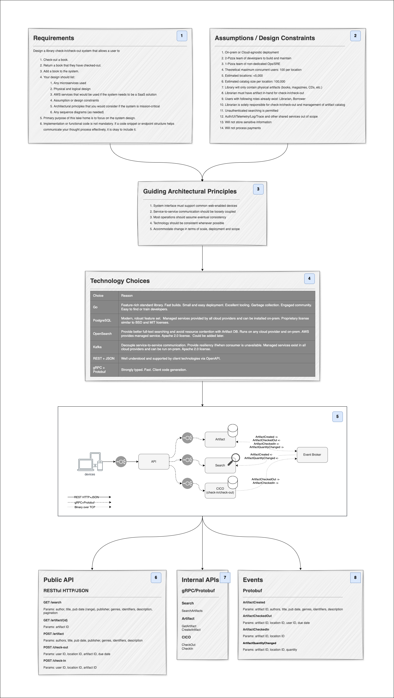

# Library Management System Design

The goal of this project is to design a system to address specific use-cases related to checking 
out books from a library.  The requirements, assumptions and design considerations are all 
included in the first document below.  It is recommended that you review the documents in the 
order listed.

> **Note:** Some links require either Draw.io or PlantUML to load the original files.  I have 
> included PNGs as well for your convenience.

## Overview

### [Requirements, design decisions & logical diagram](./system/library.drawio)



## Sequence Diagrams

### [All Use-Cases](./sequence/useCases.puml)

#### Find a Book 


#### Check-out a Book 


#### Check-in a Book 


#### Add a Book 


## Data Models

> **Note:** The tool I used for this (PlantUML) is not well-suited for this purpose and I did not 
> have enough time to convert them. I typically write SQL statements for this purpose when I'm 
> not modeling vaporware.

## Search Service

Artifact Document - Denormalized representation of an artifact (book, magazine, or CD) from 
which indexes may be derived to provide rich and fast searching.

```json
{
    "id": 123,
    "identifiers": {"isbn": "0143107323"},
    "authors": [{
        "id": 456,
        "first_name": "Mark",
        "last_name": "Twain"
    }],
    "title": "Adventures of Huckleberry Finn",
    "published_on": "2014-06-01",
    "genres": [
        {"id": 10, "name": "fiction"},
        {"id": 11, "name": "adventure fiction"},
        {"id": 12, "name": "humor"},
        {"id": 13, "name": "satire"}
    ],
    "language": "English",
    "publisher": "Penguin Classics; Reissue edition",
    "pages": 400,
    "status": {
        "1": { "qty_available": 0, "due_on": "2024-06-30" },
        "2": { "qty_available": 2, "due_on": null }
    }
}
```

## Artifact Service

[Artifact Database](data/artifact.dbml) - System of record for books, magazines and other 
artifacts available. See [artifact.dbml](data/artifact.dbml) for more details.
for 
check-out in the library.


## Check-in/Check-out "CICO" Service 

[CICO Database](data/CICO.dbml) - System of record for check-in and check-out events. See 
[cico.dbml](data/CICO.dbml) for more details.


## [AWS EKS Design](./system/eks.drawio)

This service could be deployed many different ways and which choice depends on more than just my 
opinion. The design depicted favors resiliency, adaptability and scalability but comes at a cost 
of complexity.

